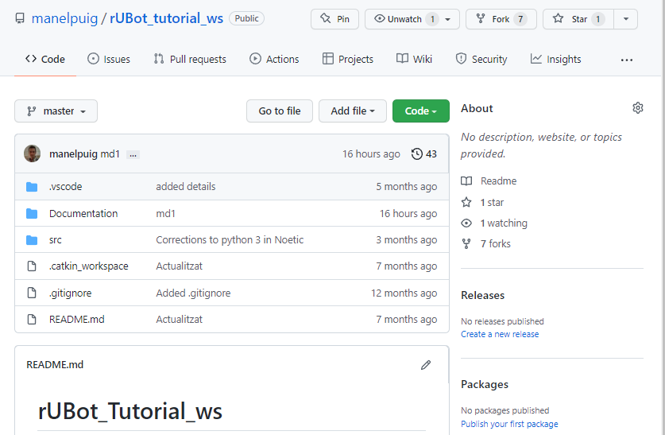

# **1. ROS environment setup**

First of all we will learn how to work within a ROS environment. You will have to choose between 2 possibilities:
- use a free and opensource ROS environment. 
- install the ROS Noetic in your computer from a Docker utility. 

## **1.1 Free ROS environment**

You have available the ROS environment offered for free by some companies like "The Construct".

You will need only a google navigator:
- Open the link to this environment: https://app.theconstructsim.com/Home
- Create an account with user and password 
- In the section "Your Rosjects" you can create your custom environment
- Open a "New Rosject"

## **1.2 ROS Installation using Docker utility**

You have to install:

**a) Docker for windows:** an easy to install application that enables you to manage your containers (https://docs.docker.com/desktop/install/windows-install/)

* Then you have to complete your installation with WSL 2 for kernell update in: https://learn.microsoft.com/ca-es/windows/wsl/install-manual#step-4---download-the-linux-kernel-update-package
* Stablish WSL2 as default by opening a powershell and typing: wsl --set-default-version 2
* restart your computer

**b) X11 display server**: Xming X server for Windows (https://sourceforge.net/projects/xming/), and XQuartz for macOS (https://www.xquartz.org/index.html). That will allow you to visualize, in particular the RViZ robot visualization and tools and the Gazebo simulation of the robot.

**c)** **Visual Studio Code** (https://code.visualstudio.com/)

### **1.2.1 ROS1 Images**

Official images are:

- ROS Noetic: osrf/ros:noetic-desktop-full
- Open PowerShell and type:

```shell
docker pull osrf/ros:noetic-desktop-full
or
docker pull osrf/ros:humble-desktop-full
```

To create a Container (choose proper name) with GUI and folder share (select your src absolute location), open a terminal and type:

```shell
docker run --name ROS1_Noetic_osrf -e DISPLAY=host.docker.internal:0.0 --mount src="C:\Users\puigm\Desktop\ROS_github\myPC_shared",dst=/home/myDocker_shared,type=bind -it osrf/ros:noetic-desktop-full
or
docker run --name ROS2_Humble_osrf -e DISPLAY=host.docker.internal:0.0 --mount src="C:\Users\puigm\Desktop\ROS_github\myPC_shared",dst=/home/myDocker_shared,type=bind -it osrf/ros:humble-desktop-full
```

### **1.2.2. XLaunch**

For graphical interface, open Xlaunch:

- First choose “Multiple windows” and set to 0 the "Display number”
- Then, set “Start no client” in the second screen
- In the third screen, click “Clipboard” and "Primary Selection", unclick "Native opengl" and click "Disable access control"
- And just click “Finalize” in the last screen

For graphical interface in Mac os X:
 - Install last version of XQuartz.
 - Open preferences and in Security mark allow connections from network clients
 - In a new terminal on your local machine add localhost in xhost: > xhost + 127.0.0.1

### **1.2.3. VS Code**

We will use VS Code to sync a copy of your github repository **in your local PC**:

- Open VS Code and choose "Clone repository"
- type the github link of the desired repository
- select the local destination folder

We will also use VS Code to work and sync the changes we have made **in Docker Container**:

- Run the docker container
- Open Visual Studio Code and Install the extensions:

    - Docker

    - Dev Containers

    - Git Extension Pack (when you are connected with container)

- Connect the container to VS Code:
    - from left-side menu choose Docker
    - right-click on the running container and select "Attach VS Code"
- Update your docker Container:
```shell
apt update
apt upgrade
```

> repeat these instructions until you see "All packages are up to date"

Install some functionalities you will need:

```shell
apt install -y git && apt install -y python3-pip
```
- Re-start the container
## **2. Prepare your Workspace**

Once you are in the ROS Noetic container, you can:

- create your own workspace
- Use an existing workspace

### **2.1 Create your own workspace**

This is the best option to learn ROS. You will create a new repository and you will follow the instructions to create all the packages to fulfill the objectives and functionalities.

- In your github account:
    - create a new public repository
    - add gitignore with ROS option

- In your docker container (within VS Code):
    - Clone your new created repository in /home folder
    - compile 

### **2.2 Use an existing workspace**

You can also use our repository and make your modifications according to the exercises we will propose you.
In that case, you can follow the instructions:

- Fork the "rubot_tutorial_ws" repository from my github
  
- Open your Docker container with ROS Noetic
- Using VS Code, connect to the ROS1_Noetic running container
- Clone your forked directory in your home directory of container

  ```shell
  git clone https://github.com/yourusername/rUBot_tutorial_ws
  ```
- Open .bashrc file (from root) with VS Code (open file...)
- Ensure that you have the last 2 lines (review the exact name of your repository):

  ```xml
  source /opt/ros/noetic/setup.bash
  source /home/rUBot_tutorial_ws/devel/setup.bash
  ```
- open a new terminal and Compile:

  ```shell
  cd /home/rUBot_tutorial_ws
  catkin_make
  ```
- You are ready to work with your repository for this session

## **3. Repository syncronisation**

**In Docker container** (within VS Code), you need to:

- Select "source control" from left side menu
- select changes to sync
- Add a commit
- Push

**In your local PC**, you need:
- Within VS Code: you need to do the same.
- Alternativelly you could:
    - Use github web editor
    - use github Desktop
