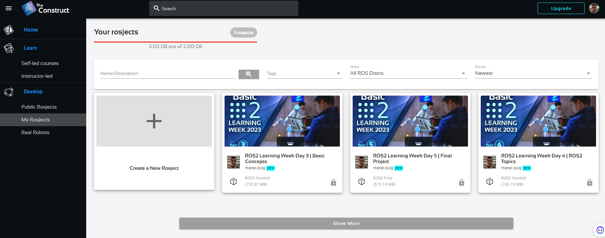
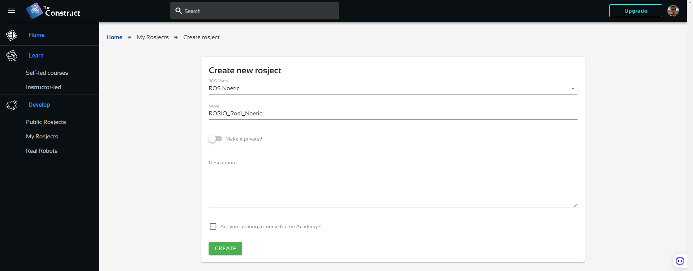

# **1. ROS environment setup**

You can use the ROS environment developed by "The Construct" (https://app.theconstructsim.com/), enterprise working on ROS academia and development and located in Barcelona.
- Open the link: https://app.theconstructsim.com/
- Create a free user account
- Select "myRosjects"

- Create a New Project

You will have 2GB Virtual machine with Ubuntu 20 and ROS Noetic installed for free!!

# **2. Prepare your Workspace**

Once you are in the ROS Noetic environment, you can use our repository and make your modifications according to the exercises we will propose you.
In that case, you can follow the instructions:

- Fork the "rUBot_tutorial_ws" repository from my github
  
- Open your ROS Noetic environment:  https://app.theconstructsim.com/
- Clone your forked directory in your home directory of container
  ```shell
  cd /home/user
  git clone https://github.com/your_username/rUBot_tutorial_ws
  cd rUBot_tutorial_ws
  catkin_make
  ```
- Open .bashrc file (from user) with VS Code (open file...)
- Ensure that you have the last 2 lines (review the exact name of your repository):

  ```xml
  source /opt/ros/noetic/setup.bash
  source /home/user/rUBot_tutorial_ws/devel/setup.bash
  ```
You are ready to work with your repository for this session!

# **3. Repository syncronisation**

The objective is to update the changes you have made, when working in ROS environment, in your github repository.

- Access to the TheConstruct environment local repository:
  ````shell
  cd /home/user/rUBot_tutorial_ws
  ````
- Update the local repository with possible changes in github origin repository
  ````shell
  git pull
  ````
- You can work with your local repository for the speciffic project session
- Once you have finished and you want to syncronize the changes you have made and update the github origin repository, type:
  ````shell
  git add .
  git commit -m "Message"
  git push
  ````
- When you will Push them, the first time you will be asked to link the repository to your github account:
- Open a terminal in and type the first time:
  ```shell
  git config --global user.email "mail@alumnes.ub.edu"
  git config --global user.name "your github username"
  ```
- for succesive times, you only need to select changes, Commit a message and Push
- You will have to specify the Username and Password (Personal Access Token you have generated)

To obtain the **PAT** in github follow the instructions:

  - Log in to GitHub
  - Go to Developer Settings
  - Select Access Personal Access Tokens: Choose Tokens (classic)
  - Click Generate new token (classic) and configure it:
    - Add a note to describe the purpose of the token, e.g., "ROS repo sync."
    - Set the expiration (e.g., 30 days, 60 days, or no expiration).
    - Under Scopes, select the permissions required:
      - For repository sync, you usually need: repo (full control of private repositories)
    - Click Generate token
  - Once the token is generated, copy it immediately. You won't be able to see it again after leaving the page.

Your github origin repository has been updated!


