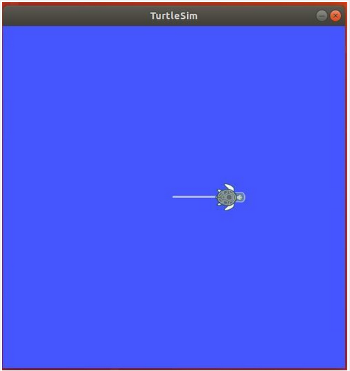
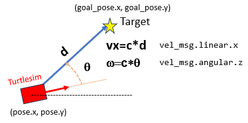

# **ROS Tutorial Turtlesim Script Programming**
Let's now create our proper Turtlesim package with different python nodes to perform simple navigation control exemples of Turtlesim robot.

This tutorial has been extracted from the following references:
- http://wiki.ros.org/ROS/Tutorials
- http://www.clearpathrobotics.com/assets/guides/kinetic/ros/
- ROS free course in Udemy: https://www.udemy.com/share/101GMwAEITeFhTRX4F/
- ROS Course Anis Koubaa: https://www.udemy.com/ros-essentials/
- ROS course Edouard Renard: https://www.udemy.com/share/1022ucAEITeFhTRX4F/

## **Navigation control of Turtlesim**
A specific package "turtlesim_tutorial" is created where different motion control programs will be done.

Within this package, a node "/move_turtle" can be created to communicate with the "/turtlesim" node.

This node is created in order to perform a speciffic motion control function:
- publishes in the /turtle1/cmd_vel topic 
- subscribes to the /turtle1/pose topic

This is performed following the tutorial:
- http://wiki.ros.org/turtlesim/Tutorials
- http://wiki.ros.org/turtlesim/Tutorials#Practicing_Python_with_Turtlesim
- http://wiki.ros.org/turtlesim/Tutorials/Go%20to%20Goal
- https://github.com/Apress/Robot-Operating-System-Abs-Begs


The package is already created, but we remind you how to create a "turtlesim_tutorial" package with dependencies (rospy, geometry_msgs, turtlesim)

In src directory:
```shell
cd src
catkin_create_pkg turtlesim_tutorial rospy geometry_msgs turtlesim
cd ..
catkin_make
```
We have also created folders:
- "scripts" where we have placed python programs for speciffic motion control functions. 
- "launch" where execution programs are placed

Let's perform different exercises to understand how to programm the motion control functions in ROS environment.

### **Exercise: Move distance with turtlesim**
Develop a python script to perform the following functionalities.
- Specify a distance in x direction for turtlesim to move
- Read the Pose of turtlesim
- if the Pose.x is lower than the the distance specified, publish linear and angular speed
- if the Pose.x is higher, then stop


Create in "scripts" folder the python file "move_distance.py"

Create in "launch" folder a launch file "move_distance.launch" to run all nodes with speciffic useful parameters:
```xml
<?xml version="1.0" encoding="UTF-8"?>
<launch>
        <arg name="v" default="0.5"/>
        <arg name="w" default="0"/>
        <arg name="d" default="7"/>
    <node pkg="turtlesim" type="turtlesim_node" name="turtlesim_node"/>
    <node pkg="turtlesim_tutorial" type="move_distance.py" name="move_turtle" output="screen" >
        <param name="v" value="$(arg v)"/>
        <param name="w" value="$(arg w)"/>
        <param name="d" value="$(arg d)"/>
    </node>
</launch>
```

To execute it, type:
```shell
roslaunch turtlesim_tutorial move_distance.launch
```




### **Exercise: Go to target point with turtlesim**
Develop a ROS node to perform the following functionalities.
- Specify a target point (x,y) with a tolerance for turtlesim to move
- Read the Pose of turtlesim
- if the turtlesim Position is far from the point, publish linear and angular speed
- if it is close within the tolerance, stops


We can describe graphically how we will control the turtlesim:


We can use **Object Oriented Programming**, creating a "TurtleBot" python Class and use input parameters to specify the target point and tolerance

Object Oriented Programming (OOP) is everywhere in python. 
- OOP is a way to organize your code into Classes. 
- A Class a sort of container of objects with a set of attributes (variables/properties) and methods (functions)

Create a "/move_turtle" node with go2point functionality. This is defined in the "go2point.py" python file.

Create a "go2point.launch" launch file to setup all needed nodes:
```xml
<?xml version="1.0" encoding="UTF-8"?>
<launch>
        <arg name="x" default="1"/>
        <arg name="y" default="1"/>
        <arg name="tol" default="0.1"/>
    <node pkg="turtlesim" type="turtlesim_node" name="turtlesim_node"/>
    <node pkg="turtlesim_tutorial" type="go2point.py" name="move_turtle" output="screen" >
        <param name="x" value="$(arg x)"/>
        <param name="y" value="$(arg y)"/>
        <param name="tol" value="$(arg tol)"/>
    </node>
</launch>
```
To execute, type:
```shell
roslaunch turtlesim_tutorial go2point.launch
```


### **Activity 2: ROS turtlesim go2pose**

The objective is to reach the desired position with the proper orientation also.

Create a new "go2pose.py" node, modifying the "go2point.py" node to:
- reach first the position 
- and later the orientation

### **Proposed Exercise: Move move during time interval with turtlesim**
Create a new "move_time.py" node, modifying the "move_distance.py" node to:
- Move with a generic twist vector
- during a time interval
