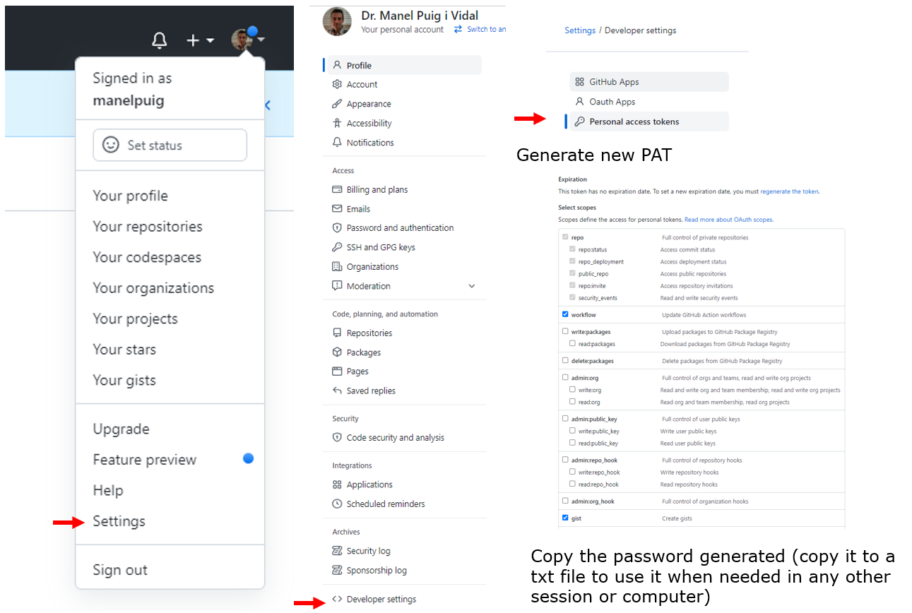

# rUBot_Tutorial_ws
This is a first tutorial to learn ROS basics.
You need to prepare your Workspace with the following instructions:

- Fork the "rubot_tutorial_ws" repository from my github


- Create a new sync permissions (Personal Access Tokens)

- Open your virtual machine Ubuntu20 with ROS Noetic and clone your forked directory in your Desktop
```shell
git clone https://github.com/yourusername/rUBot_tutorial_ws
```
- Open .bashrc file and ensure that you have the last 2 lines:
```xml
source /opt/ros/noetic/setup.bash
source ~/Desktop/rUBot_tutorial_ws/devel/setup.bash
```
- Compile:
```shell
cd ~/Desktop/rubot_tutorial_ws
catkin_make
```
- You are ready to work with your repository for this session
- When finished, syncronize the changes with your github. Open a terminal in your local repository and type the first time:
```shell
git config --global user.email mail@alumnes.ub.edu
git config --global user.name 'your github username'
```
- for succesive times, you only need to do:
```shell
git add ./*
git commit -a -m 'message'
git push
```
- you will need to insert the username and the saved PAT password